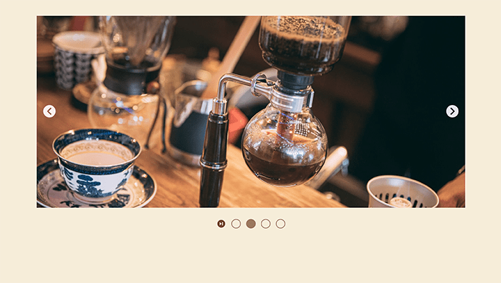

# Image-carousel

 
This **image carousel** was developed as part of an assignment to demonstrate understanding of Dynamic User Interface Interactions from The Odin Project. For details on this project, please visit the lesson on ['Image Carousel'](https://www.theodinproject.com/lessons/node-path-javascript-dynamic-user-interface-interactions#image-carousel).

## Key Project Instructions:

- Set up images within a `div` element.
- Create functions for the **back** and **next** buttons within the carousel to navigate through the images. Fancy slide effects are not required.
- Add horizontally laid out **indicator dots** below the image carousel. These dots should be empty circles that fill in to indicate the current carousel image index. The dots should also be clickable, allowing users to skip to their preferred image.
- Configure the carousel to **loop every 5 seconds**.

## Built With:

- HTML
- CSS
- JavaScript
- Webpack
- ESLint
- Prettier

 

---

### Resources Used

- UI Designing Tool by [Figma.com](https://www.figma.com)
- Images by [PAKUTASO](https://www.pakutaso.com/)
- SVG Icons by [Pictogrammers](https://pictogrammers.com/library/mdi/)
- Searching Tool by [ChatGPT4](https://chat.openai.com)
